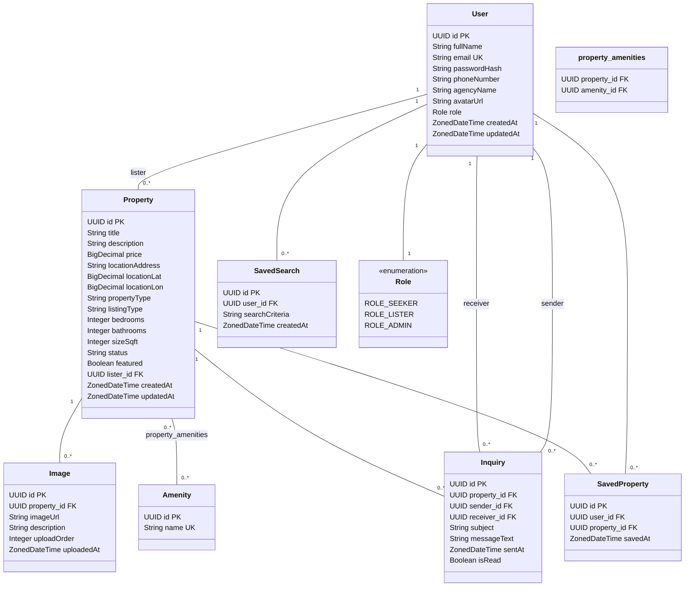

# PropertyHub Database UML Diagram

Based on the POJOs in the codebase, here's a UML diagram representing the database tables architecture:

## Table Relationships

1. **User**:
   - One-to-many relationship with Property (a user can list multiple properties)
   - One-to-many relationship with Inquiry (as both sender and receiver)
   - One-to-many relationship with SavedProperty (a user can save multiple properties)
   - One-to-many relationship with SavedSearch (a user can save multiple searches)
   - Has a Role (enum)

2. **Property**:
   - Many-to-one relationship with User (a property has one lister)
   - One-to-many relationship with Image (a property can have multiple images)
   - One-to-many relationship with Inquiry (a property can have multiple inquiries)
   - One-to-many relationship with SavedProperty (a property can be saved by multiple users)
   - Many-to-many relationship with Amenity (a property can have multiple amenities)

3. **Amenity**:
   - Many-to-many relationship with Property (an amenity can be associated with multiple properties)

4. **Image**:
   - Many-to-one relationship with Property (an image belongs to one property)

5. **Inquiry**:
   - Many-to-one relationship with Property (an inquiry is about one property)
   - Many-to-one relationship with User as sender (an inquiry is sent by one user)
   - Many-to-one relationship with User as receiver (an inquiry is received by one user)

6. **SavedProperty**:
   - Many-to-one relationship with User (a saved property belongs to one user)
   - Many-to-one relationship with Property (a saved property reference is to one property)
   - Has a unique constraint on the combination of user_id and property_id

7. **SavedSearch**:
   - Many-to-one relationship with User (a saved search belongs to one user)

This UML diagram represents the database schema of the PropertyHub application, showing all entities, their attributes, and the relationships between them.